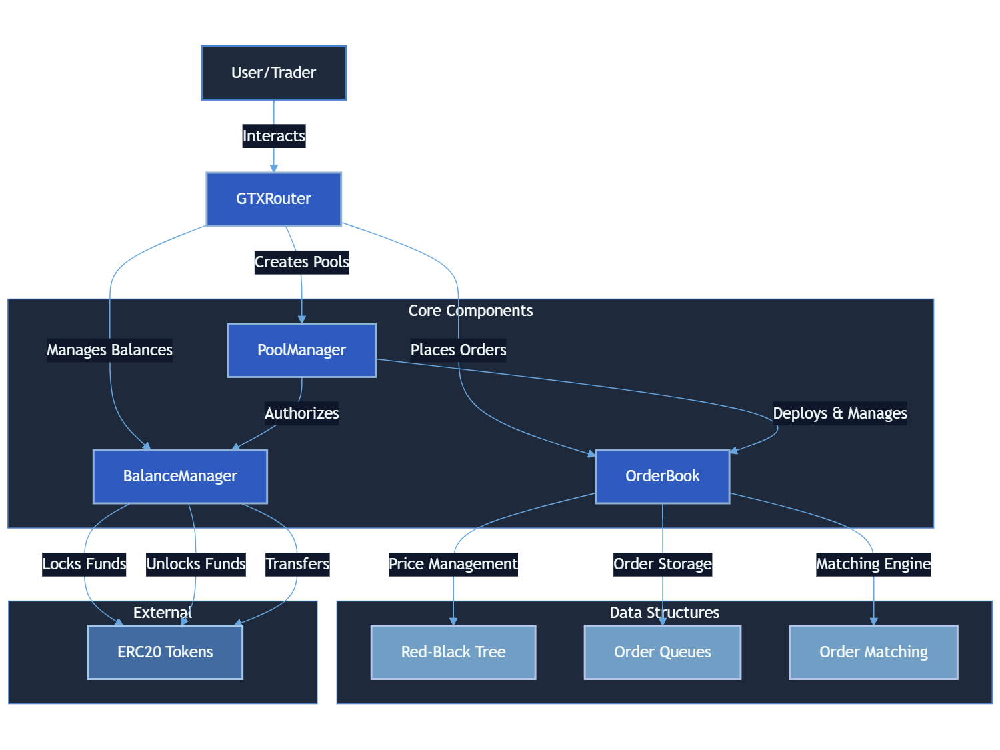

# 🚀 CLOB DEX - Next-Gen Decentralized Exchange

> 💫 Building the future of trustless trading on RISE Network

[](https://opensource.org/licenses/MIT)
[](https://www.riselabs.xyz)

## 🌟 Vision

Revolutionizing DeFi trading with a high-performance, fully on-chain Central Limit Order Book (CLOB). Our mission is to bring CEX-grade performance with DEX-level trustlessness.

## 🏗️ System Architecture



The CLOB DEX system consists of four main components:
- **GTXRouter**: Entry point for all user interactions
- **PoolManager**: Manages trading pairs and pool deployments
- **OrderBook**: Handles order placement and matching using RB-Tree
- **BalanceManager**: Manages token deposits, withdrawals, and locks

## 💎 Core Features

### 🔄 Advanced Order Types
- 📊 Limit Orders with precision pricing
- ⚡ Instant Market Orders
- 🎯 Smart order routing

### ⚙️ High-Performance Engine
- 🏃‍♂️ O(log n) matching algorithm
- 📈 Price-time priority execution
- 🔍 Real-time order book updates
- 🔒 Atomic settlements

### 🏗️ Architecture Highlights

#### 🌳 Red-Black Tree Price Levels
- O(log n) operations for inserting/removing price levels
- Quick access to best bid/ask prices
- Ordered iteration through price levels

#### 📜 Order Queues
- Double-linked list for order storage at each price level
- FIFO (First In, First Out) execution within same price level
- Efficient order removal and updates

### 🗃️ Data Storage Optimization
- **Order Packing**: Compact order storage using bit manipulation
  ```solidity
  Side (1 bytes) | Price (64 bytes) | OrderId (48 bytes)
  ```
- **Active Order Tracking**: Per-user order tracking using EnumerableSet
- **Price Level Management**: Automatic cleanup of empty price levels

### 🔑 Key Data Structures

```solidity
// Price Tree Mapping
mapping(Side => RBTree.Tree) private priceTrees;

// Order Queues at Each Price Level
mapping(Side => mapping(Price => OrderQueueLib.OrderQueue)) private orderQueues;
```

### 👀 View Functions
- Get best bid/ask prices
- View order queue status at any price level
- Retrieve user's active orders
- Get next best price levels with volumes

## ⛽ Gas Optimization Techniques

1. **Efficient Storage**
   - Minimal storage operations
   - Packed order data
   - Optimized mappings

2. **Smart Data Structures**
   - Red-Black Tree for price levels (O(log n) operations)
   - Double-linked lists for order management
   - EnumerableSet for tracking active orders

3. **Memory Management**
   - Strategic use of memory vs storage
   - Optimized array operations
   - Efficient event emission

## 🔒 Security Features

1. **Access Control**
   - Order cancellation restricted to order owner
   - Reentrancy protection on all state-modifying functions

2. **Input Validation**
   - Price and quantity validation
   - Order existence checks
   - Price level integrity checks

3. **State Management**
   - Atomic operations
   - Consistent state updates
   - Automatic cleanup of empty states

# 🔗 Links to contracts on RiseLabs Testnet Explorer

## Contract Addresses and Links

Here are the deployed contract addresses and their corresponding links on the RiseLabs Testnet Explorer:

- **OrderBook Contract**
  - **Address:** `0x92D8387421fe5205051C82E4a6473E0aC5cc636b`
  - **Explorer Link:** [View on RiseLabs Testnet Explorer](https://testnet-explorer.riselabs.xyz/address/0x92D8387421fe5205051C82E4a6473E0aC5cc636b)

- **BalanceManager Contract**
  - **Address:** `0xf997fBd9747841513d26d895072a7f35e5125cfc`
  - **Explorer Link:** [View on RiseLabs Testnet Explorer](https://testnet-explorer.riselabs.xyz/address/0xf997fBd9747841513d26d895072a7f35e5125cfc)

- **PoolManager Contract**
  - **Address:** `0x2A61148905eA1cf87f352249DD92215C8eA0fdD5`
  - **Explorer Link:** [View on RiseLabs Testnet Explorer](https://testnet-explorer.riselabs.xyz/address/0x2A61148905eA1cf87f352249DD92215C8eA0fdD5)

- **GTXRouter Contract**
  - **Address:** `0xe0eCBC144f924bD5bA7C7D9b373795EFA2F3589B`
  - **Explorer Link:** [View on RiseLabs Testnet Explorer](https://testnet-explorer.riselabs.xyz/address/0xe0eCBC144f924bD5bA7C7D9b373795EFA2F3589B)

The following mock token addresses are used for creating pools in the OrderBook.

- **Mock USDC Contract**
  - **Address:** `0x02950119C4CCD1993f7938A55B8Ab8384C3CcE4F`
  - **Purpose:** This is a mock USDC token used for testing the OrderBook functionalities.
  - **Explorer Link:** [View on RiseLabs Testnet Explorer](https://testnet-explorer.riselabs.xyz/address/0x02950119C4CCD1993f7938A55B8Ab8384C3CcE4F)

- **Mock WETH Contract**
  - **Address:** `0xb2e9Eabb827b78e2aC66bE17327603778D117d18`
  - **Purpose:** This is a mock WETH token used for testing the OrderBook functionalities.
  - **Explorer Link:** [View on RiseLabs Testnet Explorer](https://testnet-explorer.riselabs.xyz/address/0xb2e9Eabb827b78e2aC66bE17327603778D117d18)

- **Mock WBTC Contract**
  - **Address:** `0xc2CC2835219A55a27c5184EaAcD9b8fCceF00F85`
  - **Purpose:** This is a mock WBTC token used for testing the OrderBook functionalities.
  - **Explorer Link:** [View on RiseLabs Testnet Explorer](https://testnet-explorer.riselabs.xyz/address/0xc2CC2835219A55a27c5184EaAcD9b8fCceF00F85)

- **Mock Chainlink Contract**
  - **Address:** `0x24b1ca69816247Ef9666277714FADA8B1F2D901E`
  - **Purpose:** This is a mock Chainlink token used for testing the OrderBook functionalities.
  - **Explorer Link:** [View on RiseLabs Testnet Explorer](https://testnet-explorer.riselabs.xyz/address/0x24b1ca69816247Ef9666277714FADA8B1F2D901E)

- **Mock PEPE Contract**
  - **Address:** `0x7FB2a815Fa88c2096960999EC8371BccDF147874`
  - **Purpose:** This is a mock PEPE token used for testing the OrderBook functionalities.
  - **Explorer Link:** [View on RiseLabs Testnet Explorer](https://testnet-explorer.riselabs.xyz/address/0x7FB2a815Fa88c2096960999EC8371BccDF147874)

## Foundry Smart Contract Setup Guide

This document provides a comprehensive guide for setting up, deploying, and upgrading smart contracts using Foundry. Follow the instructions below to get started.

---

## Prerequisites

Before proceeding, ensure you have the following installed:

- [Foundry](https://book.getfoundry.sh/)
- Node.js (required for generating ABI files)
- A compatible Ethereum wallet for broadcasting transactions
- A `.env` file to configure network and wallet details

---

## Installation and Setup

1. Clone the repository:
   ```bash
   git clone https://github.com/Great-Trading-eXperience/clob-dex.git
   cd clob-dex
   ```

2. Install dependencies:
   ```bash
   forge install
   ```

3. Duplicate the `.env.example` file in the root directory, rename it to `.env`, and set the required variables.

---

## Deployment Guide

### Deploying Contracts
To deploy contracts, use the following command:
```bash
make deploy network=<network_name>
```
- Example:
  ```bash
  make deploy network=riseSepolia
  ```

### Deploying and Verifying Contracts
To deploy and verify contracts:
```bash
make deploy-verify network=<network_name>
```

---

## Mock Contracts Deployment

### Deploying Mocks
To deploy mock contracts, use:
```bash
make deploy-mocks network=<network_name>
```

### Deploying and Verifying Mocks
To deploy and verify mock contracts:
```bash
make deploy-mocks-verify network=<network_name>
```

---

## Contract Upgrades

### Upgrading Contracts
To upgrade contracts:
```bash
make upgrade network=<network_name>
```

### Upgrading and Verifying Contracts
To upgrade and verify contracts:
```bash
make upgrade-verify network=<network_name>
```

---

## Additional Commands

- **Compile Contracts**
  ```bash
  make compile
  ```

- **Run Tests**
  ```bash
  make test
  ```

- **Lint Code**
  ```bash
  make lint
  ```

- **Generate ABI Files**
  ```bash
  make generate-abi
  ```

- **Help**
  Display all Makefile targets:
  ```bash
  make help
  ```

---

## Notes

- Replace `<network_name>` with the desired network (e.g., `arbitrumSepolia`, `mainnet`).
- Ensure your `.env` file is correctly configured to avoid deployment errors.
- Use the `help` target to quickly review all available commands:
  ```bash
  make help
  ```
